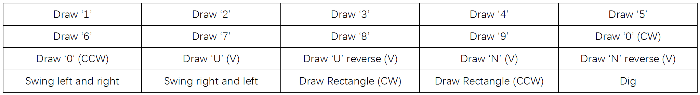
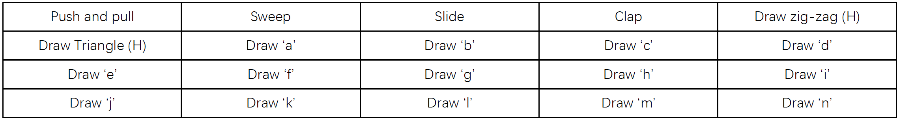

# OneFi: One-Shot Recognition for Unseen Gesture with COTS WiFi


This repo contains the code of the following paper:

> OneFi: One-shot Recognition for Unseen Gesture with COTS WiFi

## Tested Environment

We tested our codes under this environment:

- MATLAB 2020b
- Python  3.8.5
- PyTorch 1.7.1

## How to use the code

- Please follow the instructions under virtual-gesture-generation folder to perform data augmentation. (corresponding to Sec.4 in paper).
  - Add the virtual-gesture-generation folder to the path in MATLAB first.
  - Run `compute_velocity_distribution.m`. 
    - This function will take raw CSI data (`.dat` file) as input and output corresponding velocity distribution. 
    - The format of computed velocity_distribution is of shape: `[velocity_x_bin, velocity_y_bin, timestamps]`.
    - Save the velocity_distribution as `.mat` file for further usage. Code example: `save("1-1-1-1.mat", 'vd')`.
    - This function would take around 30 mins to run because of the inherent slow optimization computation.
  - Run `create_virtual_gesture.m`.
    - This function will take the computed virtual gesture as input from the `.mat` file.
    - The input parameter `direction` is the rotation angle for data augmentation. In our paper, we set `direction` as (30, 60, … 330) so that our base dataset is expanded by 12 times (Please refer to our paper for more details.)
- Please follow the instructions under few-shot-learning folder to perform one-shot learning (corresponding to Sec.5 in paper). Please replace `train_data.npy` and `test_data.npy` with your own data. 

- Please feel free to **open an issue or send us an email** if there are any questions about the paper and the code usage.

## Citation

If it is useful for your research, please consider cite the following reference paper:

```
@inproceedings{onefi,
  author    = {Rui Xiao and
               Jianwei Liu and
               Jinsong Han and
               Kui Ren},
  title     = {OneFi: One-Shot Recognition for Unseen Gesture via {COTS} WiFi},
  booktitle = {SenSys '21: The 19th {ACM} Conference on Embedded Networked Sensor
               Systems, Coimbra, Portugal, November 15 - 17, 2021},
  pages     = {206--219},
  publisher = {{ACM}},
  year      = {2021},
  url       = {https://doi.org/10.1145/3485730.3485936},
  doi       = {10.1145/3485730.3485936},
  timestamp = {Mon, 15 Nov 2021 13:08:25 +0100}
}
```

## Appendix

Training Set:



Testing Set:



H: horizontally; V: Vertically

CW: clockwise; CCW: counterclockwise